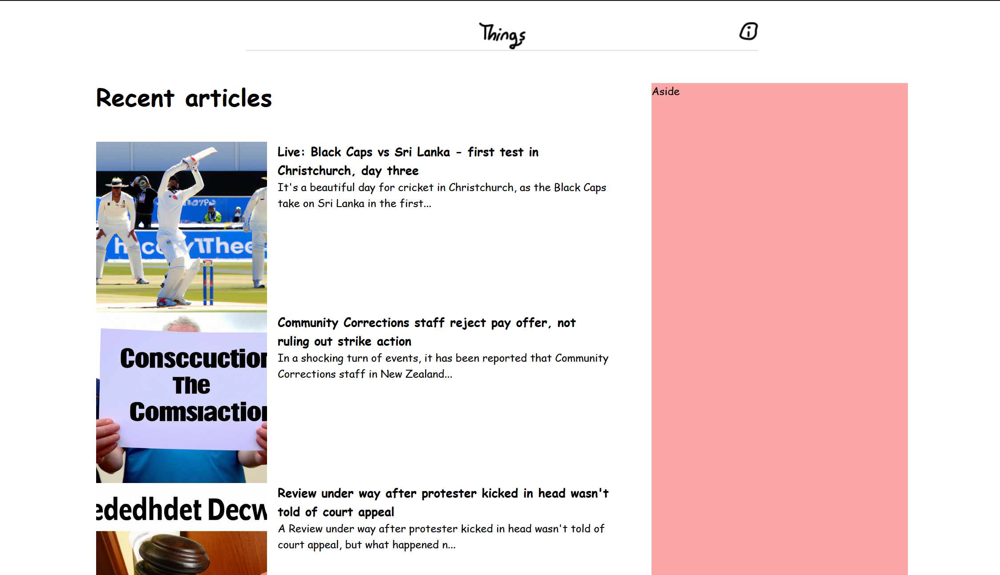

# Terrible Hackathon Project

## Things News

ChatGPT generated news article parodies of Stuff New Zealand articles. Uses cron jobs to check <a href="https://www.stuff.co.nz">Stuff</a> RSS and then generate a fake parody article based off the title. ChatGPT will generate a fake thumbnail then we upload it to an imagebb storage bucket, then the entire article to our Supabase PostgreSQL database. Front-end then requests our api endpoint for the articles and then displays them with react and tailwind.

